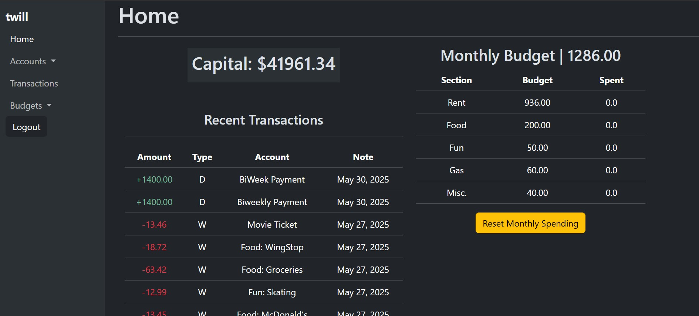

# Finance Tracker Web App 💲
> Finance tracker web app for tracing finance history, budgets, and allocating funds

## 🧐 About 
This project was built to serve as a personal means for budgeting and tracking expenses. It is a web application built using the Django framework and uses a sqlite3 database given its scale. There is potential of furthering and deploying the project in the future.


## 💬 Usage
```bash
# Terminal
# Execute program
python manage.py runserver
```

## 💫 Preview



## ▶ Features
- **Track Transactions**  ⬆⬇
    - Record transaction information: amount, reason, associated bank account, date, and budget connection
- **Multiple Bank Account** 💵
    - Setup multiple different sources of capital and organize funds between these accounts. (e.g Savings, Checking)
- **Custom Budgets** 📓
    - Create custom budgets to allocate funds. This includes a specific monthly budget to specify monthly expenses within specific ranges
- **Multiple Users** 🧑‍🤝‍🧑
    - Support for multiple different users with information isolated and protected between users

## :phone: Contact
Tai Williams - twilliamsa776@gmail.com
https://github.com/TWilliamsA7/FinanceTracker